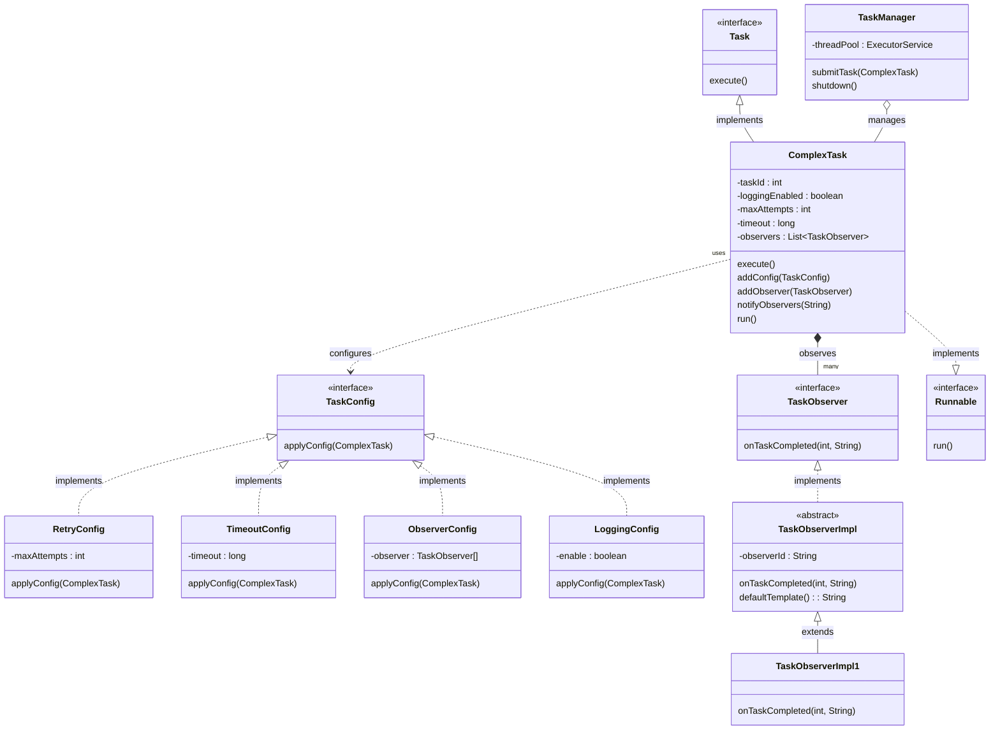

# Fully Automatic Beverage Vending Machine

## Compile and Execute the code

| CS-665       | Software Design & Patterns |
|--------------|----------------------------|
| Name         | Yulong Liu                 |
| Date         | 04/14/2024                 |
| Course       | Spring                     |
| Assignment # | 6                          |

# Assignment Overview

Examine this project assignment and improve the solutions for assignment2.

# GitHub Repository Link:

https://github.com/nioliu/cs-665-assignment-2/tree/main

# Refactor points

## Create AbstractDriver class:

- Reason: Reduce redundant code and enhance the clarity and maintainability of the code structure.
- Change content: Move the common implementation of the Driver interface (`driverLicense()` and `driverType()`
  methods) to AbstractDriver. All concrete driver classes (such as `TaxiDriver`, `FreelanceVan`, etc.) now inherit from
  `AbstractDriver`.

## Log system integration:

- Reason: Unify log processing and simplify log management.
- Change content: Initialize the Logger object in `AbstractDriver` and use this log object in all inherited subclasses.

## Use of constants and static methods:

- Reason: Avoid repeatedly defining and using the same string in multiple places to improve code readability and
  maintainability.
- Change content: Define static constants or methods in `AbstractDriver` to manage the
  string template used in `receiveNewDeliveryRequest`.

## UML



## How to use?

```java
 public void TestBasic() {
    DeliveryRequest deliveryRequest1 = new DeliveryRequest("1"); // subject
    Retailer1 retailer1 = new Retailer1(deliveryRequest1);
    Driver taxiDriver1 = new TaxiDriver("123");// observer
    Driver taxiDriver2 = new TaxiDriver("456");// observer
    Driver taxiDriver3 = new TaxiDriver("789");// observer
    Driver taxiDriver4 = new TaxiDriver("111");// observer
    Driver taxiDriver5 = new TaxiDriver("222");// observer
    Driver taxiDriver6 = new TaxiDriver("333");// observer

    deliveryRequest1.registerObserver(taxiDriver1, taxiDriver2, taxiDriver3, taxiDriver4, taxiDriver5, taxiDriver6);

    retailer1.notify(new Delivery.
            AdditionalDeliveryDetail("keyboard", "999, Boston, MA", 19.99));
}
```

# Maven Commands

We'll use Apache Maven to compile and run this project. You'll need to install Apache Maven (https://maven.apache.org/)
on your system.

Apache Maven is a build automation tool and a project management tool for Java-based projects. Maven provides a
standardized way to build, package, and deploy Java applications.

Maven uses a Project Object Model (POM) file to manage the build process and its dependencies. The POM file contains
information about the project, such as its dependencies, the build configuration, and the plugins used for building and
packaging the project.

Maven provides a centralized repository for storing and accessing dependencies, which makes it easier to manage the
dependencies of a project. It also provides a standardized way to build and deploy projects, which helps to ensure that
builds are consistent and repeatable.

Maven also integrates with other development tools, such as IDEs and continuous integration systems, making it easier to
use as part of a development workflow.

Maven provides a large number of plugins for various tasks, such as compiling code, running tests, generating reports,
and creating JAR files. This makes it a versatile tool that can be used for many different types of Java projects.

## Compile

Type on the command line:

```bash
mvn clean compile
```

## JUnit Tests

JUnit is a popular testing framework for Java. JUnit tests are automated tests that are written to verify that the
behavior of a piece of code is as expected.

In JUnit, tests are written as methods within a test class. Each test method tests a specific aspect of the code and is
annotated with the @Test annotation. JUnit provides a range of assertions that can be used to verify the behavior of the
code being tested.

JUnit tests are executed automatically and the results of the tests are reported. This allows developers to quickly and
easily check if their code is working as expected, and make any necessary changes to fix any issues that are found.

The use of JUnit tests is an important part of Test-Driven Development (TDD), where tests are written before the code
they are testing is written. This helps to ensure that the code is written in a way that is easily testable and that all
required functionality is covered by tests.

JUnit tests can be run as part of a continuous integration pipeline, where tests are automatically run every time
changes are made to the code. This helps to catch any issues as soon as they are introduced, reducing the need for
manual testing and making it easier to ensure that the code is always in a releasable state.

To run, use the following command:

```bash
mvn clean test
```

## Spotbugs

SpotBugs is a static code analysis tool for Java that detects potential bugs in your code. It is an open-source tool
that can be used as a standalone application or integrated into development tools such as Eclipse, IntelliJ, and Gradle.

SpotBugs performs an analysis of the bytecode generated from your Java source code and reports on any potential problems
or issues that it finds. This includes things like null pointer exceptions, resource leaks, misused collections, and
other common bugs.

The tool uses data flow analysis to examine the behavior of the code and detect issues that might not be immediately
obvious from just reading the source code. SpotBugs is able to identify a wide range of issues and can be customized to
meet the needs of your specific project.

Using SpotBugs can help to improve the quality and reliability of your code by catching potential bugs early in the
development process. This can save time and effort in the long run by reducing the need for debugging and fixing issues
later in the development cycle. SpotBugs can also help to ensure that your code is secure by identifying potential
security vulnerabilities.

Use the following command:

```bash
mvn spotbugs:gui 
```

For more info see
https://spotbugs.readthedocs.io/en/latest/maven.html

SpotBugs https://spotbugs.github.io/ is the spiritual successor of FindBugs.

## Checkstyle

Checkstyle is a development tool for checking Java source code against a set of coding standards. It is an open-source
tool that can be integrated into various integrated development environments (IDEs), such as Eclipse and IntelliJ, as
well as build tools like Maven and Gradle.

Checkstyle performs static code analysis, which means it examines the source code without executing it, and reports on
any issues or violations of the coding standards defined in its configuration. This includes issues like code style,
code indentation, naming conventions, code structure, and many others.

By using Checkstyle, developers can ensure that their code adheres to a consistent style and follows best practices,
making it easier for other developers to read and maintain. It can also help to identify potential issues before the
code is actually run, reducing the risk of runtime errors or unexpected behavior.

Checkstyle is highly configurable and can be customized to fit the needs of your team or organization. It supports a
wide range of coding standards and can be integrated with other tools, such as code coverage and automated testing
tools, to create a comprehensive and automated software development process.

The following command will generate a report in HTML format that you can open in a web browser.

```bash
mvn checkstyle:checkstyle
```

The HTML page will be found at the following location:
`target/site/checkstyle.html`


